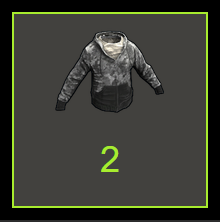
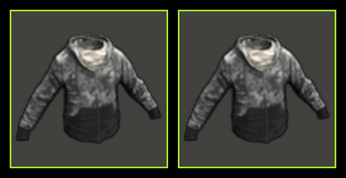

# Steam Bulk Buyer
## Description
### What does the code do?
The program performs the purchases in Steam Item Store instead of you using the WebDriver tools. The script buys items one by one, avoiding the "stacking" of the items in user's inventory. Such as this:

Making items in the inventory look like this:

## How to install
### Requirements
* Python 3
* Chrome Browser

### How to install
1. Clone the code
2. Download the [Chrome WebDriver](https://sites.google.com/a/chromium.org/chromedriver/downloads) that fits the your version of Chrome
3. Install `Selenium` for Pyhton, run this command in Terminal or CMD:  
  If you have **only Python 3 installed**:  
    `pip install selenium`  
  If you have **both Python 2 and Python 3 installed**:  
    `pip3 install selenium`
4. Specify the **absolute** PATH for ChromeDriver in `DRIVER_PATH.py`.

### How to use
1. Execute `main.py`.
2. Specify full URLs for the program and number of items you would like to buy(the program supports more than 1 item).
3. **Login** into your Steam Account and **make sure you have enough funds** on your account.
4. Press ENTER key.
5. Wait.
6. You will be notified when the process is done.
